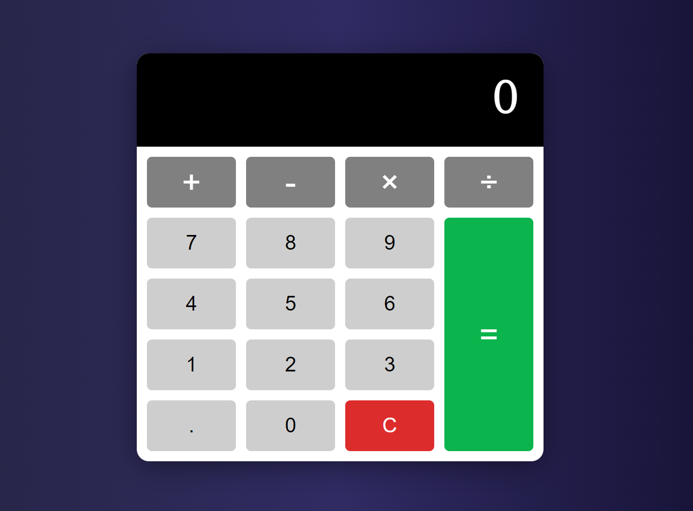

# A classic standard calculator 

I made this project for training and to learn how to set different **Event Listeners** in JavaScript.

The calculator application supports the next features:

* After pressing a **number** button, you can press only an **operator** button or **decimal point** button.
* The **decimal point** button restricts the entry of multiple decimal points. Only one is accepted.
* To see the result of an operation, the **equal** sign button or any **operator** button can be pressed.
* After an operation has been finished, by pressing another **operator** button and then a **number** button, the operation continues.

